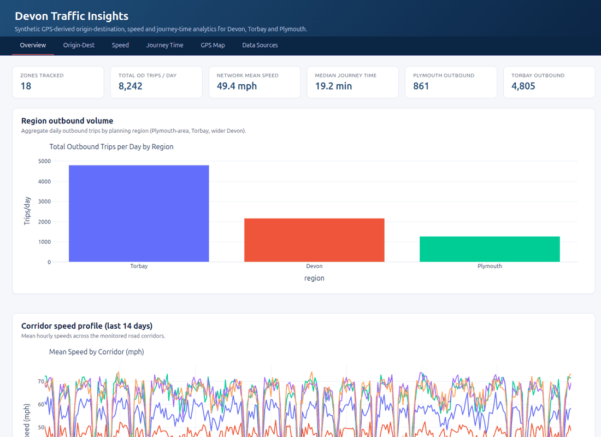

# Devon Traffic Analysis

Sample repository demonstrating origin/destination, speed, and journey-time
analytics for **Devon (including Torbay and Plymouth)** using a **FastHTML +
Plotly** dashboard, a Click CLI, and **synthetic GPS-derived data** (swap for a
real probe feed in production).



The loop above walks through the six dashboard pages. Per-page screenshots live
in [`screenshots/`](screenshots) and a narrated PDF user guide is at
[`docs/devon-traffic-user-guide.pdf`](docs/devon-traffic-user-guide.pdf).

---

## What this demonstrates

Software that offers, for Devon County (incl. Torbay & Plymouth):

- **Origin–destination traffic data** — daily trip counts between 18 Devon zones,
  built from a gravity model calibrated on population (proxying what Vodafone
  Analytics / O2 Motion / Streetlight would deliver).
- **Speed data** — hourly mean speed on 12 key corridors (M5, A38, A30, A380,
  A386, A361, A377 …) across a 14-day synthetic window, including the morning
  and evening rush-hour dips.
- **Journey-time data** — per-observation journey-time distributions between 8
  common OD pairs (Plymouth↔Exeter, Exeter↔Torquay, Exeter↔Barnstaple …).
- **A GPS-ping density map** — sampled pings across Devon weighted by recorded
  speed, intended as the hook-point for a real GPS/mobile-probe feed.
- **A data-sources catalogue** — three build paths and a shortlist of free and
  commercial feeds that can replace the synthetic generator.

---

## Quick start

Requires **Python ≥ 3.10**. All commands run from the repo root.

```bash
# 1. clone & enter
git clone <this repo> traffic-data-analysis
cd traffic-data-analysis

# 2. create & activate a venv
python -m venv .venv
source .venv/bin/activate        # Windows: .venv\Scripts\activate

# 3. install
pip install -e .

# 4. run the dashboard
devon-traffic serve
#  → Starting Devon Traffic dashboard on http://127.0.0.1:5001
```

Open **http://127.0.0.1:5001** in your browser. Tabs: Overview · Origin-Dest ·
Speed · Journey Time · GPS Map · Data Sources.

---

## CLI

```bash
devon-traffic --help                 # list commands
devon-traffic summary                # print a JSON summary of the synthetic data
devon-traffic serve --port 5001      # run the FastHTML dashboard
devon-traffic generate-data --out data   # dump all tables as parquet under data/
devon-traffic export od --out od.csv     # export a single table as CSV
devon-traffic export journey --out -     # stream to stdout
```

Available tables: `zones`, `od`, `journey`, `speed`, `gps`.

---

## Screenshots

Captured from the live FastHTML dashboard (viewport 1400×900) via Playwright.

| # | Page | File |
|---|---|---|
| 1 | Overview         | [`screenshots/01-overview.png`](screenshots/01-overview.png) |
| 2 | Origin–Dest      | [`screenshots/02-od.png`](screenshots/02-od.png) |
| 3 | Speed            | [`screenshots/03-speed.png`](screenshots/03-speed.png) |
| 4 | Journey Time     | [`screenshots/04-journey.png`](screenshots/04-journey.png) |
| 5 | GPS Map          | [`screenshots/05-map.png`](screenshots/05-map.png) |
| 6 | Data Sources     | [`screenshots/06-sources.png`](screenshots/06-sources.png) |

A narrated **PDF user guide / product demo** is at
[`docs/devon-traffic-user-guide.pdf`](docs/devon-traffic-user-guide.pdf).

---

## Regenerating the assets

```bash
# one-time: install Playwright's browser
python -m playwright install chromium

# start the dashboard in one terminal
devon-traffic serve --port 5001

# in another terminal:
python tests/test_playwright.py   # → refreshes screenshots/*.png and docs/dashboard.gif
python scripts/make_pdf.py        # → rebuilds docs/devon-traffic-user-guide.pdf
```

`pytest tests/test_playwright.py` also doubles as a smoke test for the six
routes when the server is running. The dashboard screenshots in this repo were
originally captured via the Playwright MCP tool.

---

## Data source integrations (future)

Three pragmatic build paths, ordered from lowest cost to highest coverage:

### Path 1 — Solo, using DCC's own data

Depends on what Devon County Council will share. Typical DCC assets:

- **ANPR cameras** — Bluetooth/ANPR traces can build OD matrices for corridors
  they cover.
- **MOVA / SCOOT / UTMC signal + loop data** → link-level speed + flow (no OD).
- **Bluetooth beacons** (e.g. BlueTruth) on key corridors → journey-time series.
- **Existing traffic counts + DfT Road Traffic Statistics** → AADT by link.

Assemble OD from ANPR + Bluetooth via matrix-estimation (gravity / Furness /
path-choice models) — a legit transport-modelling technique. **Gap:** rural
Devon coverage is thin; no cross-county trip inference without GPS.

### Path 2 — Solo, using open data + ML synthesis

DfT open data + OSM + Strava Metro (active travel only) + synthetic OD via ML
(graph neural nets, gravity-model neural calibration, entropy-maximisation
against Census 2021 commute flows). Cheap and differentiated, but weaker on
coverage score.

### Path 3 — Commercial probe-data integration (recommended)

Best coverage and signal quality; requires contracts.

**Free / open**

- **Department for Transport** traffic counts — AADT & hourly counts by road link.
  <https://roadtraffic.dft.gov.uk/downloads>
- **National Highways WebTRIS** — motorway / strategic-road-network loop
  detectors, incl. M5. <https://webtris.highwaysengland.co.uk/>
- **Devon County Council open data** — local road counts, bus patronage, cycle
  counters. <https://www.devon.gov.uk/roadsandtransport>
- **OS Open Roads / OS Open Zoomstack** — free road-network geometry.
- **Bus Open Data Service (BODS)** — national bus timetables + real-time.
  <https://data.bus-data.dft.gov.uk/>
- **OpenStreetMap + Overpass / Valhalla** — free routing, turn-by-turn ETAs.
- **ONS Census 2021 OD (commute flows)** — MSOA/LSOA ground-truth for OD calibration.
- **Strava Metro** — aggregated cycling/walking GPS (free for public bodies).

**Commercial — probe / mobile / GPS**

- **Vodafone Analytics** — UK mobile-network-derived OD flows, dwell-times,
  visitor analytics.
- **Telefónica / O2 Motion** — aggregated O2 mobility insights; strong South-West
  coverage.
- **BT Active Intelligence / EE Mobility** — mobile probe data on EE's network.
- **HERE Traffic API & Probe Data** — real-time link speeds, historic 5-min bins.
- **TomTom Traffic Stats / O-D Analysis** — floating-car data with
  commercial-fleet GPS; strong on A-roads.
- **INRIX Roadway Analytics** — probe-vehicle speeds, incidents, OD analyses.
- **Google Maps Distance Matrix API** — live & typical travel times.
- **Mapbox Movement** — anonymised mobile-SDK GPS aggregates.
- **Streetlight Data (Jacobs)** — mobile + nav-GPS OD matrices; widely used by
  UK DfT studies.
- **Cuebiq / Veraset / Huq Industries** — raw device-level GPS panels.
- **Teralytics** — telco-derived trip chains and OD.

**ANPR / camera**

- **Devon & Cornwall Police ANPR** (via data-sharing agreement).
- **Vivacity Labs** — classified multi-modal counts + journey times.
- **Clearview Intelligence M100** — Bluetooth / Wi-Fi travel-time network
  (commonly deployed on A38 / A30).

### Suggested integration pattern

1. Replace `devon_traffic.data.build_*` with adapters pulling from each feed's
   API or nightly dump.
2. Cache normalised **parquet per feed** under `data/`.
3. Reconcile zone geometries to a common **MSOA** or custom TAZ layer.
4. Blend: use Census 2021 OD as **prior**, calibrate with Vodafone/O2 expansion
   factors, validate with **WebTRIS** counts.

---

## Repository layout

```
traffic-data-analysis/
├── src/devon_traffic/
│   ├── data.py        # synthetic zones, OD, speed, journey, GPS generators
│   ├── charts.py      # Plotly figure builders
│   ├── app.py         # FastHTML dashboard (6 routes)
│   └── cli.py         # Click CLI: serve / summary / generate-data / export
├── scripts/
│   ├── make_gif.py    # stitches screenshots/*.png → docs/dashboard.gif
│   └── make_pdf.py    # narrated product demo → docs/devon-traffic-user-guide.pdf
├── tests/
│   └── test_playwright.py   # route smoke-test + screenshot capture
├── screenshots/       # 6 dashboard screenshots (1400×900 full-page)
├── docs/
│   ├── dashboard.gif
│   └── devon-traffic-user-guide.pdf
├── pyproject.toml
└── README.md
```

---

## Notes

- All numbers in the dashboard are **synthetic**. Do not cite for operational
  decisions.
- The synthetic generator is deterministic — reset the seed via
  `SynthConfig(seed=…)` in `devon_traffic.data`.
- FastHTML renders server-side; Plotly figures are embedded as HTML snippets
  (no extra build tooling, no bundler).
